# 🛠️ DayZ Tools Overview 📋

DayZ Tools are essential for modding and map creation in DayZ. This suite provides various utilities to help you build, modify, and publish custom content for the game.

---

## 📑 Table of Contents
- [What DayZ Tools Offer](#-what-dayz-tools-offer)
- [System Requirements](#%EF%B8%8F-system-requirements)
- [How to Install DayZ Tools](#%EF%B8%8F-how-to-install-dayz-tools)
  - [Pre-Requisites](#-pre-requisites)
  - [Installing via Steam](#-installing-via-steam)
  - [Alternative Drive Installations](#-alternative-drive-installations)
- [Setting Up the P Drive](#-setting-up-the-p-drive)
- [Fundamental Tools Required to Create Maps](#-fundamental-tools-required-to-create-maps)
  - [Detailed Tool Descriptions](#-detailed-tool-descriptions)
- [Troubleshooting Tips](#%EF%B8%8F-troubleshooting-tips)
- [Additional Resources](#-additional-resources)
  - [Discord Servers](#-discord-servers)

---

## ⭐ What DayZ Tools Offer

DayZ Tools come with a set of applications and utilities that cover everything from object building to terrain editing and publishing content. These tools allow you to:
- Create and edit 3D objects.
- Process and refine terrain data.
- Configure economy settings, including loot and zombie spawns.
- Convert files to the formats required by the DayZ engine.
- Publish mods to the Steam Workshop.

---

## 🖥️ System Requirements

To run DayZ Tools effectively, ensure that your system meets the following minimum requirements:

- **Operating System**: Windows 10 or later
- **CPU**: Quad-core Intel or AMD processor, 3.0 GHz or faster
- **Memory**: 8 GB RAM (16 GB or more recommended)
- **Graphics**: DirectX 11 compatible GPU with 2 GB VRAM (4 GB or more recommended)
- **Storage**: 20 GB of free disk space for DayZ and DayZ Tools
- **Additional Software**: Microsoft Visual C++ Redistributable for Visual Studio 2019

> **Note**: DayZ Tools are only available on Windows. Mac and Linux are not supported.

---

## ⬇️ How to Install DayZ Tools

### 🔑 Pre-Requisites

To use DayZ Tools, you must first purchase a copy of DayZ. You can buy it from the Steam store:

- **Purchase DayZ**: [https://store.steampowered.com/app/221100/DayZ/](https://store.steampowered.com/app/221100/DayZ/)

  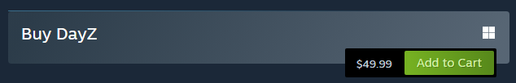

### 📥 Installing via Steam

Once you have DayZ, you can download DayZ Tools through Steam. Follow these steps:

1. Open the Steam application.
2. Go to the **Library** tab.
3. In the **Games** dropdown, select **Tools**.

    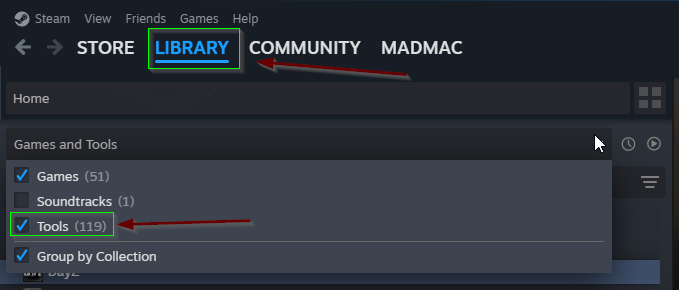

4. Search for "DayZ Tools" and click **Install**.

    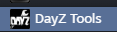

- **Install DayZ Tools**: [https://store.steampowered.com/app/830640/DayZ_Tools/](https://store.steampowered.com/app/830640/DayZ_Tools/)

### 🚀 Alternative Drive Installations

If you have DayZ or DayZ Tools installed on a different drive (e.g., an SSD or secondary HDD), keep the following in mind to ensure smooth functionality:

1. **Consistent File Paths**: Ensure that DayZ and DayZ Tools are installed on the same drive. If they are on different drives, some tools may have trouble locating game files.

2. **Steam Library Setup**: If you’re installing on a secondary drive, add the drive as a **Steam Library Folder**:
   - In Steam, go to **Steam > Settings**

      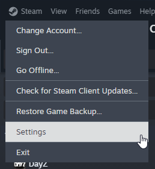

   - In the `STEAM SETTINGS` popup window, select **Storage** on the sidebar.

      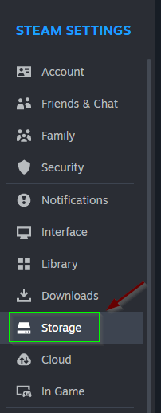

   - Locate the dropdown and select the drive where you want your games/tools to be installed, such as DayZ Tools.

      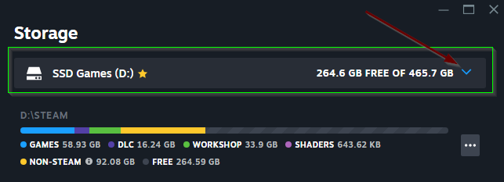

3. **Configure DayZ Tools Path**: In DayZ Tools, go to **Settings > Configure Path** and ensure that paths for DayZ and other tools are pointing to the correct locations on your drive. Incorrect paths can lead to missing files or crashes.

    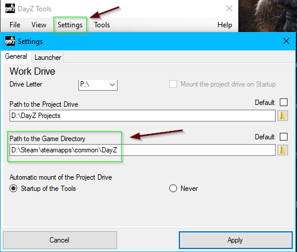

4. **Permissions**: If DayZ Tools or game files are installed on a secondary drive, ensure the drive permissions allow proper access. Right-click the drive in **File Explorer**, select **Properties > Security**, and make sure your user has the appropriate access (shown in the image below).

    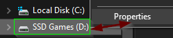
    
    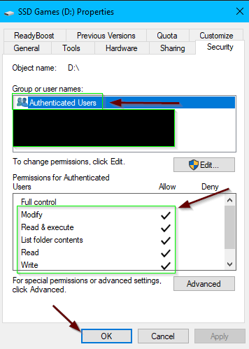

5. **Consider Disk Speed**: DayZ Tools can benefit from faster loading and processing times, so it’s ideal to install both the game and tools on an SSD if possible. However, if you’re using an HDD, be mindful that some tasks may run slower.

---

## 💾 Setting Up the P Drive

The **P Drive** is a crucial part of the DayZ modding environment as it acts as a workspace where you can safely modify game files without altering the original game installation.

### 📂 Steps to Set Up the P Drive

1. **Mount the P Drive in DayZ Tools**:
   - Open **DayZ Tools**.
   - Go to **Tools > Dismount Drive P** if the P Drive is already mounted and needs to be reset.
   - Then select **Tools > Workbench** to mount the **P Drive**.

      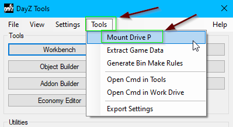

2. **Verify the P Drive is Mounted**:
   - You should see the **P Drive** appear in **File Explorer** as a new drive. It will act as your modding workspace.

      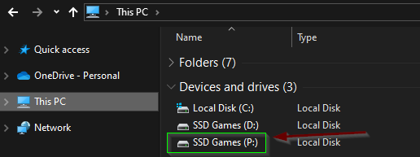

3. **Path Configuration**:
   - Make sure that **DayZ Tools** and **DayZ** are installed on the same drive, as mentioned in the installation steps. Consistent paths are critical for the P Drive to function correctly.

      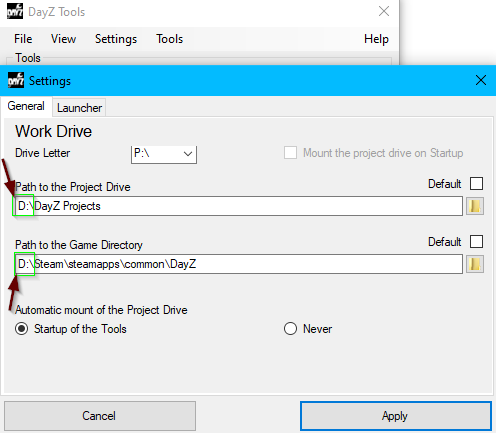

> **Tip**: The **P Drive** acts like a sandbox where you can make changes to game files without affecting the original ones, ensuring a safe and organized modding process.

---

## 🔧 Fundamental Tools Required to Create Maps

DayZ Tools include various components. Here’s an overview of the most important ones for map creation and modding:

| Tool               | Description                                                                                           |
|--------------------|-------------------------------------------------------------------------------------------------------|
| **Workbench**      | Enfusion engine game core, used for scripting, particles, editing, and UI development.                |
| **Addon Builder**  | Converts data into readable formats similar to `.zip` or `.rar`. Even though this is an option for creating mods, a better software to use is `PboProject`. This gives better error details when issues occur. Please refer to our [Mikero Tools Overview](../mikero_tools/Mikero_Tools_Overview.md) guide on how to install `PboProject`.                                      |
| **Publisher**      | Publishes mods to Steam, making them accessible for others to download and play.                      |
| **Terrain Builder**| Shape terrain, add objects, and preview in Bulldozer.                                                 |
| **Object Builder** | Create simple or complex 3D models/assets to play in the game. Acts as a Blender substitute.          |
| **Economy Editor** | Configure spawn points for loot, zombies, etc. Defines spawn locations, spawn radius, and other settings. Typically used as the final step in map creation. |

### ✨ Detailed Tool Descriptions

- **Workbench**: This is the core interface for working with the Enfusion engine. It’s used for scripting, creating particles, editing UI components, and setting up the core logic for mods. You can also use it to manage the overall project structure.
  
- **Addon Builder**: This tool compresses and prepares files for the game. It converts DayZ files into PBO format (binary packages) and prepares the files for distribution, ensuring compatibility and ease of deployment.
  
- **Publisher**: Once your mod is complete, the Publisher tool allows you to upload it directly to the Steam Workshop. This tool streamlines the process, making it easy to share your work with the DayZ community.

- **Terrain Builder (TB)**: A powerful tool that allows you to create and modify terrains. It supports shaping landscapes, placing objects, and applying textures. Terrain Builder works in conjunction with the Bulldozer preview to visualize your changes in real-time.

- **Object Builder (OB)**: Used to create and import 3D models and objects into the game. This tool allows you to design simple and complex assets, configure object properties, and set collision boundaries. For creators without access to Blender, Object Builder serves as a comprehensive modeling tool.

- **Economy Editor**: This tool lets you configure the spawn points, spawn radius, and probabilities for loot, NPCs (zombies), and vehicles. This is usually the final step in map creation, helping balance gameplay by controlling resource distribution and spawn points.

---

## 🛠️ Troubleshooting Tips

1. **DayZ Tools Not Launching**: Make sure your Visual C++ Redistributables are up to date. DayZ Tools require these libraries to function properly. Download and install the latest versions from the Microsoft website.

2. **Missing Textures in Bulldozer**: If you encounter missing textures in the Bulldozer preview, verify that all file paths are correct and that textures are located in the specified folders. Incorrect paths can cause rendering issues.

3. **Bulldozer Crashes**: Bulldozer is resource-intensive and may crash if your system is low on memory. Ensure other applications are closed, and consider increasing virtual memory if crashes persist.

4. **PBO Conversion Issues**: Ensure that the filenames and paths comply with DayZ's naming conventions. Non-ASCII characters or spaces in filenames can cause issues with the Addon Builder.

---

## 📚 Additional Resources

- **Official DayZ Modding Documentation**: [Bohemia Interactive Wiki](https://community.bistudio.com/wiki/DayZ)
- **Steam Workshop for DayZ**: [DayZ Workshop](https://steamcommunity.com/app/221100/workshop/)
- **DayZ Modders Discord Community**: Join the community for help, tips, and sharing mods with other developers.

### 🤝 Discord Servers

Here are some Discord servers where you can find help and connect with other DayZ modders and developers:

- **World Design Resources (ike_0zzy)**: [https://discord.gg/XUPUZSUbZc](https://discord.gg/XUPUZSUbZc)
- **Modding Shed of Hunterz**: [https://discord.gg/aXYm5fn7gw](https://discord.gg/aXYm5fn7gw)
- **DAYZ**: [https://discord.gg/dayz](https://discord.gg/dayz)
- **DZ Academy (Big Grampa)**: [https://discord.gg/78VCuPtpbU](https://discord.gg/78VCuPtpbU)
- **Longtime Squad (Matthew Longtime)**: [https://discord.gg/rWfhRp6uuB](https://discord.gg/rWfhRp6uuB)

These servers provide a platform to share knowledge, seek assistance, and discuss DayZ modding and development.

---

## 🖼️ Images

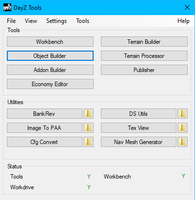
> Screenshot of the DayZ Tools interface showing the main tool options, including Workbench, Terrain Builder, Object Builder, Addon Builder, and Economy Editor.

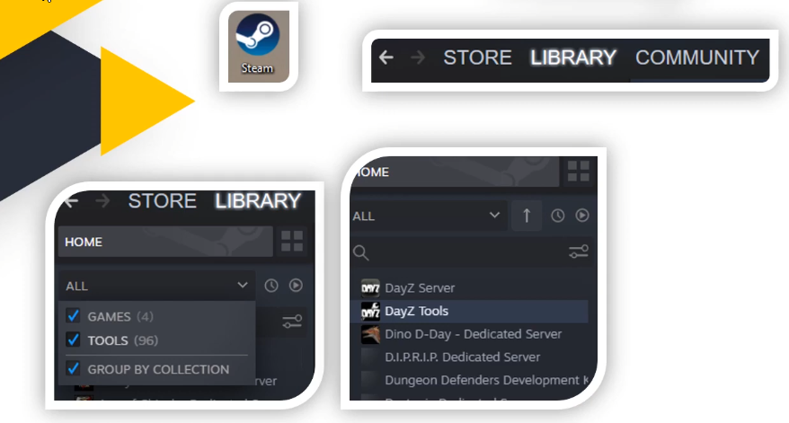
> Step-by-step guide on locating and installing DayZ Tools through the Steam Library.

---

By following these instructions and using the tools listed above, you'll have everything needed to start creating maps and mods for DayZ.

