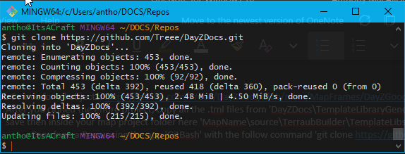
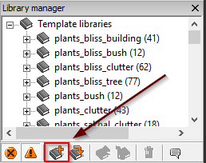
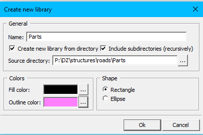
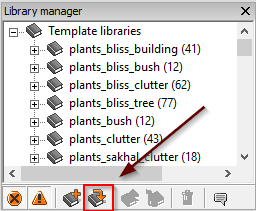
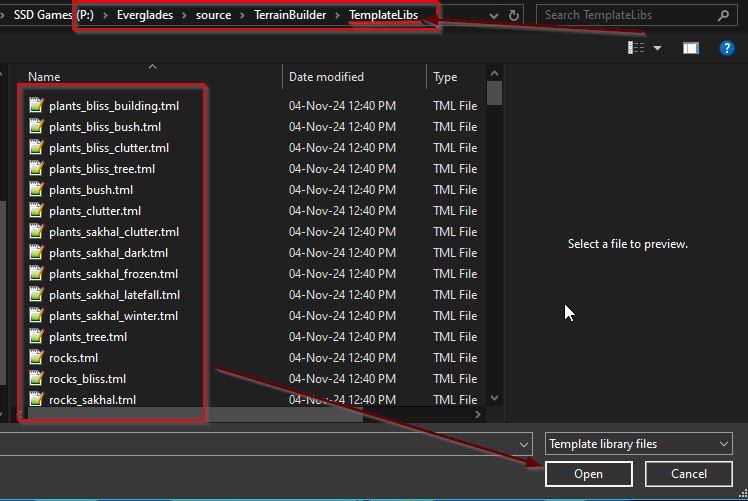

# Adding Objects in Terrain Builder

This guide covers how to add objects in Terrain Builder using the Library Manager.

---

## GitHub Source for All Objects

- Repository link: [Treee/DayZDocs](https://github.com/Treee/DayZDocs/blob/main/MapFrames/DayZGoodMapFrameValues.md)
- After cloning the entire project, copy all `.tml` files from `DayZDocs\TemplateLibraryGenerator\output` to the `MapName\source\TerrainBuilder\TemplateLibs` folder in your project.

### Clone the Repository

To clone the repository, use Git Bash with the following command:

```bash
git clone https://github.com/Treee/DayZDocs.git
```

This will download the necessary files to your computer.



---

## Create Custom Template Library Manually

1. **Open Library Manager**:
   - Inside Terrain Builder, navigate to `Library Manager`.
   - Click on `Create New Library` to begin adding objects.

      

2. **Populate Fields in the Popup**:
   - **Name**: Leave blank; it will auto-generate when you select your object folder.
   - **Checkbox**: Check `Create new library from directory`.
   - **Source Directory**: Navigate to your project folder where objects are stored (e.g., `P:\DZ\structures\roads\Parts`).

      

3. **Configure Colors and Shape**:
   - **Fill Color**: Sets the color displayed in Terrain Builder.
   - **Outline Color**: Changes the outline color for object visibility.
   - **Shape**: Select `Rectangle` or `Ellipse` to determine the object shape in Terrain Builder.

---

## Loading Templates into Terrain Builder from Github Repo Resource

1. **Load Templates in Library Manager**:
   - Inside Terrain Builder, open `Library Manager`.
   - Click on `load template library` to begin adding templates.

      

2. **Select All .tml Templates**:
   - Ensure that all `.tml` templates are selected.
   - Click `Open` to load them into Terrain Builder.

      

By following these steps, you will have access to the pre-configured objects and templates within Terrain Builder, allowing you to quickly set up and customize your map.

---

### Explanation of Additions

1. **GitHub Repository Link**: Direct link added to access the repository.
2. **Cloning the Repository**: Detailed instructions provided for cloning via Git Bash.
3. **Template Loading**: Step-by-step guidance for loading `.tml` templates, with placeholders for images (`images/load_templates.png`) to match screenshots.
  
If you have specific images, make sure they are placed in the `images` folder relative to the markdown file, or adjust the paths accordingly. Let me know if you'd like to make further adjustments!
