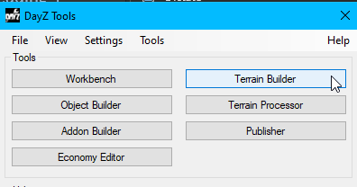
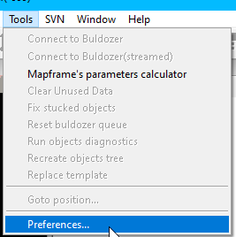
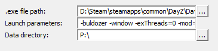

# Bulldozer Setup in Terrain Builder

Bulldozer is a preview tool in Terrain Builder for viewing and editing terrain. This guide provides setup details, key usage, and configuration tips.

## Setting Up Bulldozer

1. **Configuring Bulldozer**:
   - Open `Terrain Builder` inside `DayZ Tools`

      
   - Navigate to `Tools > Preferences...`

      
   - Click on `Buldozer` inside the `settings` popup window

      
   - Set the paths for the Bulldozer fields
      - **.exe file path**:

         ```text
         D:\Steam\steamapps\common\DayZ\DayZ_BE.exe
         ```

      - **Launch Parameters**:
         - Use these parameters for optimal performance:

            ```text
            -buldozer -window -exThreads=0 -mod= -noAsserts -nologs -profiles=P:\Buldozer -cfg=P:\Buldozer\Buldozer.cfg -name=Buldozer
            ```

      - **Data Directory**:
         - Set your data directory path (e.g., `P:\`).

---

## Bulldozer Key Usage

| Key | Usage             | Description                                                                                       |
|-----|--------------------|---------------------------------------------------------------------------------------------------|
| `F` | Swap Modes        | Toggle between Brush Tool and Object Mode.                                                        |
| `R` | Remove Object     | Select object and press `R` to remove it.                                                         |
| `5` | Rotate            | Hold to apply rotation to X-axis.                                                                 |
| `3` | Rotate (Z-axis)   | Hold to apply rotation to Z-axis.                                                                 |
| `G` | Brush Mode Toggle | Switch Brush Tool mode between Smooth and Normal (Normal raises land).                            |
| `6` | Coordinates       | Toggle between 'Object' and 'World' coordinates.                                                  |

## Additional Notes

- **Brush Tool**: When in Brush Tool mode, you can toggle between *Smooth* and *Normal* modes with `G`. Smooth smooths terrain, while Normal raises the land.
- **Object Mode**:
  - `5` to change functions within Object Mode:
    - `Modification = Rotate`
      - `1`: Hold to apply modification to X-axis.
      - `3`: Hold to apply modification to Z-axis.
    - `Modification = Scale`
    - `Modification = Elevate`
  - `6` to change Coordinates between *Object* and *World*.

> **Tip**: Press `F10` while in Bulldozer to improve visual quality for edits. This setting can be customized.

> **NOTE**: To ensure this feature works you must first add a `Custom Script` shown below

---

## Custom Script for Bulldozer

To further enhance Bulldozer, add the following script:

1. **Create the Script**:
   - Create a file named [`buldozer.c`](./buldozer.c) with the following content:

     ```c
     static void BuldozerMain() {
         // name of this file depends on the user-name (its buldozer.c when buldozer is launched with -name=Buldozer)
         // same is applied to the name of this method (<username>Main)
         // press F10 (default shortcut) to run this script in Buldozer (only available when connected to Terrain Builder)

         /*
         // Useful calls
         // sets terrain and object view distance and saves the value into the profile
         GetGame().GetWorld().SetPreferredViewDistance(1500);
         */

         /*
         // sets terrain view distance for current bz session / mission
         GetGame().GetWorld().SetViewDistance(2200);
         */
         GetGame().GetWorld().SetViewDistance(1500);

         /*
         // sets an object view distance for current bz session / mission
         GetGame().GetWorld().SetObjectViewDistance(2200);
         */
         GetGame().GetWorld().SetObjectViewDistance(1200);

         /*
         // changes overall brightness of the scene
         // 0 dark, 0< < 1 = light, 1 > darker
         GetGame().GetWorld().SetAperture(1);
         */
         GetGame().GetWorld().SetAperture(1);

         /*
         // enables/disables water in buldozer
         bool waterVisible = true;
         GetGame().GetWorld().SetBuldozerWaterEnabled(waterVisible);
         */


         /*
         // weather setup - sets clear no rain weather with next change happening in 8hrs
         Weather wo = GetGame().GetWeather();
         wo.GetRain().Set(0, 28800, 0);
         wo.GetFog().Set(0, 28800, 0);
         wo.GetOvercast().Set(0, 28800, 0);
         */
         Weather wo = GetGame().GetWeather();
         wo.GetRain().Set(0, 0, 28800);
         wo.GetFog().Set(0, 0, 28800);
         wo.GetOvercast().Set(0, 0, 28800);
         wo.SetWindMaximumSpeed(1);
         wo.SetWindFunctionParams(0.1, 0.1, 25);

         /*
         // mission date and time setup (y,m,d,hr,mn)
         GetGame().GetWorld().SetDate(1994, 9, 11, 12, 0);
         */
         GetGame().GetWorld().SetDate(2020, 12, 25, 11, 0);
      }
     ```

2. **Save Location**:
   - Place the script in the following directory:

     ```text
     P:\scripts\bulldozer.c
     ```

3. **Activate Script**:
   - To apply, restart Terrain Builder and launch Bulldozer with this configuration.

> Feel free to modify this script for additional custom settings. Comments are included in the file for reference.
