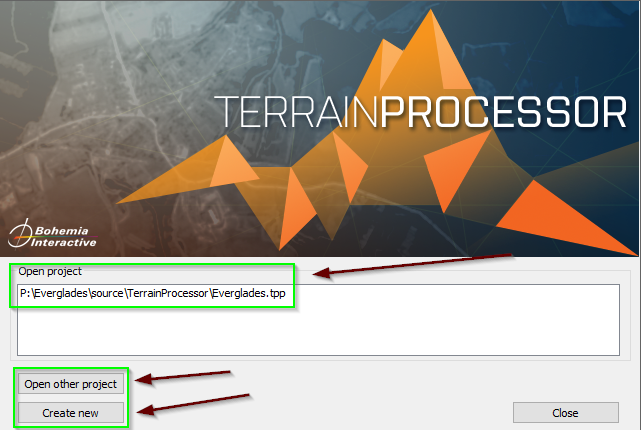

# Terrain Processor Overview

The **Terrain Processor** is a tool used within the DayZ and Arma terrain development environment to manipulate and manage large-scale terrains. This tool is particularly useful for tasks like generating road networks, adjusting elevation data, and applying custom paths or objects across complex maps. Terrain Processor can streamline the terrain development process, making it easier to create expansive and intricate landscapes for your projects.

For a detailed introduction and official documentation, refer to the [Terrain Processor Introduction](https://community.bistudio.com/wiki/Terrain_Processor:_Introduction) on the Bohemia Interactive Wiki.

## Key Features of Terrain Processor

- **Batch Processing**: Perform large-scale terrain modifications by applying transformations across multiple map regions at once.
- **Road and Path Creation**: Easily generate and modify roads, pathways, and similar linear features that can follow custom-defined curves and alignments.
- **Elevation Adjustments**: Modify terrain elevation data to create hills, valleys, and other topographical features.
- **Object Distribution**: Place objects, trees, and other elements systematically across a terrain using distribution algorithms.

## Video Tutorial: Road Creation with Terrain Processor

To get a practical understanding of using the Terrain Processor, particularly for road creation, these two video tutorial provides step-by-step guidance:

- [How to Create New Road Paths in Terrain Processor and Terrain Builder](https://youtu.be/W9ow3fXUxuQ?si=pvN8DbF3dzd0vNlW)
- [DayZ using Polylines to lay roads](https://youtu.be/6s7S6orzZ4o?si=bEP-RNUbiMcvlJsg)

These videos covers:

- **Selection and Setup**: How to select road areas in Terrain Builder and export them to the Terrain Processor.
- **Path Creation**: Using the Terrain Processor to design and adjust road paths to fit your terrain.
- **Road Modifications**: Tips for making custom road alignments and smoothing paths within your terrain.

---

## Getting Started with Terrain Processor for DayZ Modding

### Step-by-Step Guide

### 1. Prepare Your Terrain in Terrain Builder

1. **Open Terrain Builder**:
   - Ensure your map is already imported into Terrain Builder and ready for editing.
   - Please review our [Terrain Builder Overview](/tools/dayz_tools/terrain_builder/Terrain_Builder_Overview.md) guide for additional details on usage.

2. **Create a New Layer**:
   - Navigate to the **Layers Manager** and create a new layer inside the `Shapes` tab. This layer will serve as a container for specific modifications you want to make.

      
      

3. **Draw a Polyline**:
   - Make sure the new layer is selected and highlighted in the Layers Manager.
   - Use the **Polyline Tool** in Terrain Builder to draw the desired feature on the map (e.g., a road, river, boundary).

      

   - Your drawn polyline should appear in a distinct color (such as pink) as shown in the image below.

      

   - To complete the **Polyline** double-click on the last selection

4. **Select the Polyline**:
   - Switch to the **Selection Tool** and click on the polyline you just drew. Ensure it is highlighted properly (refer to the image below for a visual).

      

      

   - when you have your `Polyline` selected you can see all the properties applied. This includes the layer you have attached, the name of the `Polyline`, its position, the colors of what is displayed on the map within `Terrain Builder` and so on.

      

5. **Export the Polyline as a Shape File**:
     - After your Polyline is select you'll want to export this as a shape for `Terrain Processor`. Navigate to `File > Export > Shapes...`

         

     - In the popup window, choose the **selection source** and specify a path to save your file, such as `MyCustomMap/source/shapefiles/`, and name it (e.g., `customName.shp`). Confirm by clicking "OK," and you'll receive a confirmation popup once the export is successful.

         

         

### 2. Set Up Your Project in Terrain Processor

1. **Open Terrain Processor**:

      

   - If it's your first time using Terrain Processor, create a new project.

      

   - Name the project after your map and save it in the folder `MyCustomMap/source/TerrainProcessor/`. If this folder doesn’t exist, create it.

2. **Add the Polyline as a New Processing Line**:
   - Create a new line in Terrain Processor by clicking the icon.

      

   - In the popup, select **Line: Regular**.

      

3. **Import the Shape File**:
   - In the next window, import the `.shp` file you exported from Terrain Builder. You should now see a preview of your polyline (road layout, etc.) in the preview pane.

      

   > **`NOTE`**: If you do not have all the fields inside your `Objects` tab shown below please follow the instructions in our [TP Missing Fields Guide](/DayZ_Resources_TODO_List.md).

   

4. **Assign an Object to the Line**:
   - Switch to the **Objects Tab** and add the object you wish to use, such as a road texture or any other item (e.g., `asf1`). Ensure that the object name matches a valid object that you have already imported in the **Library Manager**.
   - After specifying the object, process the line by clicking "OK."

      

   > **NOTE**: sometimes you will have to rotate the object to ensure it lines up properly in `Terrain Builder`. You can do this with the `ROTATION` field value as shown above.

5. **Generate The Objects**:
   - Run the `Execute Tasks` button

      

   - Once the task is completed all the objects you added will be generated in a .lbt file which we will use to import into `Terrain Builder`.

      

### 3. Finalizing and Exporting

- Once the adjustments are made in Terrain Processor, bring the exported data and bring it back into Terrain Builder.
- **Import Generated Objects**: Import your objects by navigating to `File > Import > Objects...`

   

- **Import Objects From File** Select `Terrain Processor` Generated LBT File and import the objects you created in `Terrain Processor`

   

   

   > **NOTE**: After the objects completed loading into `Terrain Builder` you will see a new layer created for these objects under your `Layers Manager`. Make sure you rename this layer for proper organization.

- Once the objects have completed loading into `Terrain Builder`, it will appear based on the values you inputted inside `Terrain Processor`

   

   > **NOTE**: If you attempt to import the objects into `Terrain Builder` and you have not imported these objects under your `Library Manager` you will receive an error stating they are missing. As shown below:

   

- **Review Your Terrain in Terrain Builder**: Make any final modifications and finalize your terrain for use in-game. This can be done within Bulldozer (must ahve Steam running) by clicking the icon

   

- Inside Bulldozer you can see how your `objects` were loaded based on the values youset in `Terrain Processor`

   

---

### Advanced Tips

- **Combining Layers**: Use different layers for distinct features (e.g., roads, vegetation) to have precise control over each element. This approach will make adjusting individual features much easier during the development process.
- **Preview Changes Frequently**: It’s good practice to frequently preview your modifications in Terrain Processor before committing changes to the Terrain Builder, ensuring all adjustments align as expected.

### Summary

This guide helps you create, modify, and process terrain features using both Terrain Builder and Terrain Processor, providing you with an efficient workflow for DayZ modding. By following these steps, you'll be able to generate custom terrain features like roads, vegetation, and other map elements, streamlining your modding process.

---

This high-level guide serves as an introduction to the capabilities of Terrain Processor. As you work with this tool, you can refine and customize your approach based on the needs of your project. For additional techniques and troubleshooting, refer to the [official Bohemia Interactive Wiki](https://community.bistudio.com/wiki/Terrain_Processor:_Introduction) or the video tutorial linked above.
