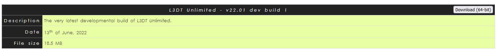

# L3DT Pro Overview

L3DT (Large 3D Terrain Generator) Pro is a professional terrain generation tool used for creating large-scale maps for applications like game modding and simulation. It is particularly useful for creating custom maps in games such as DayZ.

## Why Use L3DT Pro?

L3DT Pro offers advanced features to generate realistic landscapes with different layers, such as heightmaps, texture maps, and attribute maps. This is invaluable for modders and map creators who need precise control over their terrain features.

## Downloading the L3DT Pro Development Version

To access the Pro version, follow these steps:

1. Go to the [L3DT Pro download page](http://www.bundysoft.com/L3DT/downloads/professional/).
2. Use the following credentials:
   - **Username:** protrail_16
   - **Password:** quokka
3. Download the **Latest Development Build** for the Pro Edition.

---

## Key Map Layers for Exporting

L3DT Pro allows you to export various map layers that are essential for terrain creation. Below are the main layers you will work with:

### 1. Attributes Map

- **Description**: Also known as the satellite map, it defines various terrain attributes.
- **Export Format**: BMP
- **Save Location**: `MapName/source`
- **File Name**: `satmap.bmp`

### 2. Design Map

- **Usage**: Helps define the general landscape layout.
- **Purpose**: This map is essential for shaping the landscape and influences the creation of other layers.

### 3. Terrain Normals

- **Export Format**: BMP
- **Save Location**: `MapName/source`
- **File Name**: `normalmap.bmp`

### 4. Heightfield (Heightmap)

- **Also Known As**: Heightmap
- **Export Format**: ASC
- **Save Location**: `MapName/source`
- **File Name**: `heightmap.asc`

---

## Additional Resources

- **Tutorial**: Watch this video for an overview on how to export map files and utilize L3DT Pro for DayZ terrain mapping: [DayZ Mapping 2024 (L3DT Custom Terrain) #1](https://www.youtube.com/watch?v=3vFBKq8B2Y8&t=234s).
- `TODO: Add additional youtube tutorials`
  
- **Official Documentation**: [L3DT Pro Documentation](http://www.bundysoft.com/L3DT/docs/).
