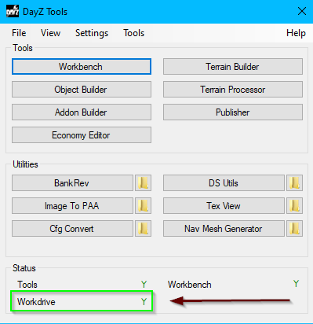
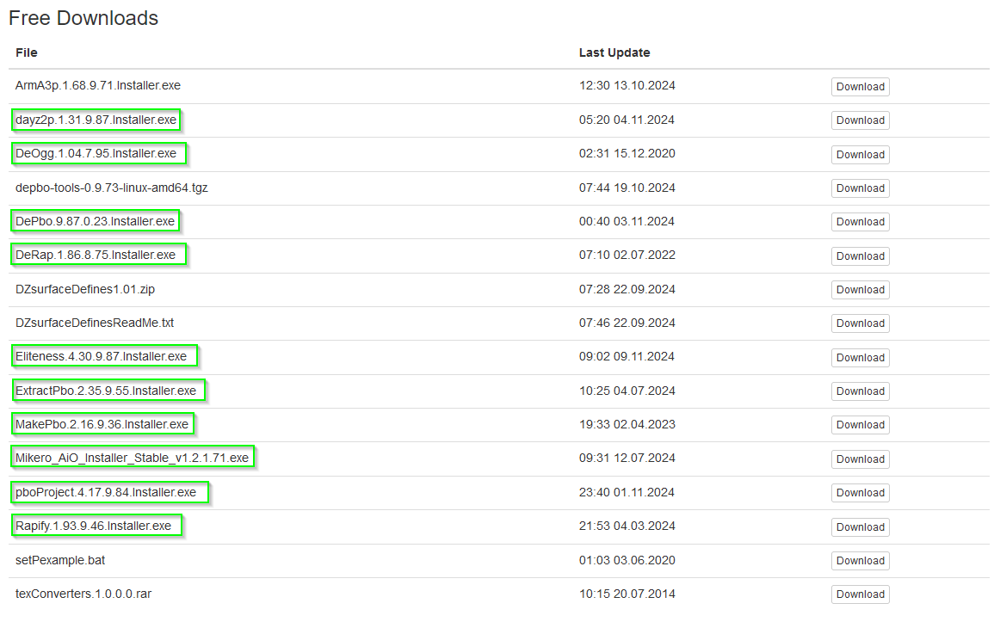
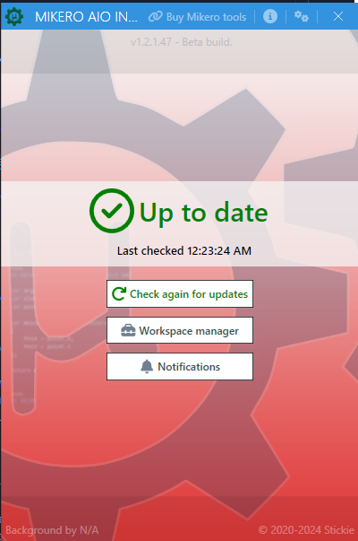
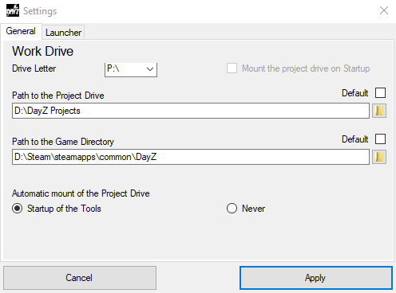
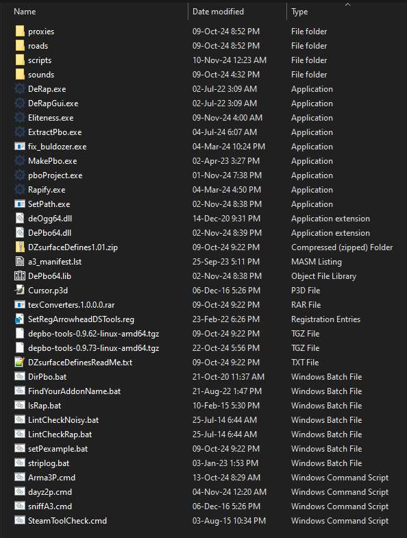
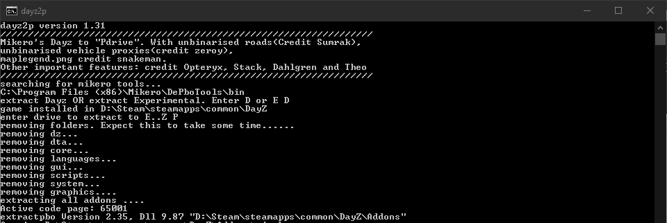
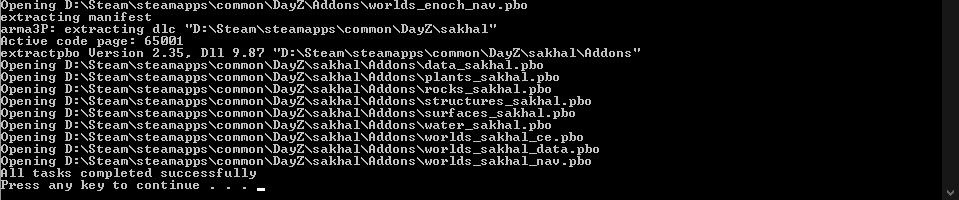

# 🛠️ Mikero Tools Overview for DayZ Map Making

This guide will help you understand the Mikero Tools 🛠️ needed for making maps 🗺️ in DayZ. We will also go over how to set everything up so you can easily make changes 🔄 to DayZ game files 📂. These tools are essential if you want to create your own terrains 🏞️, edit game features 🎮, and bring new experiences ✨ to the game.

## Prerequisites ✅

Before you install Mikero Tools 🛠️, you need to have **DayZ Tools** installed 📥 and your **P: Drive** set up as a work drive 💾. The P: Drive is like a workspace 🛠️ that lets you make changes 🔄 to files 📂 without affecting the main game 🎮. To check if your work drive is set up properly, open **DayZ Tools** and make sure the **Workdrive** status shows as `Y` ✅. If it's not set up correctly, you won’t be able to edit the game files properly. If you need more information ℹ️ on installing and setting up DayZ Tools, check out the [DayZ Tools Overview](../dayz_tools/DayZ_Tools_Overview.md).



The **P: Drive** acts like a sandbox 🏖️, which means any changes you make won’t mess up 🚫 the original game files 📂. If the P: Drive isn’t set up correctly, you will face problems ❌ when trying to use Mikero Tools 🛠️ or even DayZ Tools 🛠️.

## Required Mikero Tools 📋

To help you with map-making 🗺️ and creating custom content ✨ for DayZ, you need to install these Mikero applications 📥. Each tool 🛠️ has a specific purpose, and together they make the whole map-making process easier 😌.

- **Dayz2p**: This tool 🛠️ extracts game files 📂 so you can edit them ✏️. It converts .pbo files back to their original form 📄, making them editable.
- **DeRap**: This tool 🛠️ converts binarized .rap files into plain text 📄, which makes it easier for you to make changes ✏️ to game settings ⚙️.
- **MakePbo**: This tool 🛠️ packages 📦 your modified files back into .pbo format so they can be used by the DayZ game engine 🕹️.
- **Eliteness**: A versatile tool 🛠️ that lets you view 👀 .pbo files, read their contents 📄, and make changes ✏️.
- **ExtractPbo**: Similar to Dayz2p, this tool 🛠️ lets you break apart .pbo files so you can inspect 🔍 and modify them ✏️.
- **pboProject**: This is a project management tool 🗂️ that compiles multiple files into a .pbo, ensuring they are organized 📑 correctly for the game 🎮. I use this instead of `Addon Builder` in DayZ Tools due to the error log output is more detailed. 
- **Rapify**: Converts text-based .rap files back into a format the DayZ game engine 🕹️ can read.

You can download 📥 the tools from [HERE](https://mikero/download-link-example.com). After downloading them, use the **Mikero AIO Installer** to manage these tools easily 🤖. The AIO Installer will help keep everything up to date 🔄 and ensure all necessary components ⚙️ are installed.



### Running Mikero AIO Installer 🤖

After you download all the tools 📥, run the **Mikero AIO Installer**. This will install all the tools 🛠️ and allow you to check for updates 🔄. Once installed, open the **Mikero AIO Installer** and click **Check again for updates** to make sure all tools are current ⏳. Keeping your tools updated is important 🔄 to maintain compatibility with the latest DayZ patches 📦 and updates. The screen should look similar to this:



Updating 🔄 these tools regularly ensures you receive the latest bug fixes 🐞🔧 and new features ✨, making your workflow smoother. Updates also help ensure that your tools work well with the latest DayZ game 🎮 versions.

## Setting Up DayZ Tools First ⚙️

Before using Mikero Tools, you must ensure that **DayZ Tools** is properly set up and the **P: Drive** is mounted correctly. Follow these steps:

1. **Mounting the P Drive** 💾:
   - Open **DayZ Tools**.
   - Go to **Tools** > **Dismount Drive P** if it is already mounted and you need to reset it 🔄.
   - Make sure the paths for both the **Project Drive** and **Game Directory** are correct ✅:
     - **Path to Project Drive**: `D:\DayZ Projects`
     - **Path to Game Directory**: `D:\Steam\steamapps\common\DayZ`
   - Setting these paths correctly is important 🔄 because if they are incorrect ❌, **DayZ Tools** won’t be able to find the files you need 📂.

   > **NOTE**: The Path's above are external path examples. Your Path will most likely be located in your C: Drive. For `Project Drive` This will be any location you deemed as your Project Folder. Your `Game Directory` will be the location of where you installed your DayZ via steam.

2. **Automatic Mounting** 💾:
   - Set **Automatic mount of the Project Drive** to **Startup of the Tools**. This way, every time you start **DayZ Tools**, the **P: Drive** will be mounted automatically 🤖.
   - Click **Apply** to save your settings 💾. Doing this makes your workflow easier and reduces the chances of errors while making maps 🗺️.

      

Configuring **DayZ Tools** correctly is crucial so that all your other tools, like Mikero Tools 🛠️, work well together 🤝. The paths for the Project Drive and Game Directory need to match your work environment exactly 🔄. If they don’t, your modifications may not function properly when you try to use them in the game 🎮.

## Setting Up Mikero Tools for DayZ 🛠️

Once **DayZ Tools** and the **P: Drive** are properly set up, you can start using Mikero Tools 🛠️. Follow these steps to set everything up correctly:

1. **Locate the Installation Folder** 📂:
   - After installing Mikero Tools 🛠️, navigate to `C:\Program Files (x86)\Mikero\DePboTools\bin`.
   - This folder contains all the core tools 🛠️ you will need, such as command-line tools that help you extract or repack 🔄 .pbo files. Familiarize yourself with the location of these tools, as you will use them often during your modding work 🖥️.

   

2. **Running Dayz2p**:
   - Open `dayz2p.cmd` to begin the setup process 🔄.
   - A command-line window 🖥️ will appear and check for the DayZ installation path 📂. Follow the instructions to set up your **P: Drive** 💾.
   - This process can take a while ⏳ as it sets up all the necessary files 📂. **Dayz2p** is useful for converting game files so you can edit them ✏️ in the **P: Drive** 💾.

      
      

**Dayz2p** is an important step because it gives you editable versions of the DayZ game files 📂. These files are usually in .pbo format 📄, which means you need this step to access and change them ✏️. The initial setup may take some time ⏳ depending on the size of the game 🎮 and your computer's speed 💻, so be patient.

### Troubleshooting Dayz2p ❓

If you see an error ❌ when running **dayz2p**, it usually means the **P: Drive** 💾 is not set up correctly. Here’s how to fix it 🔧:

- Open the **DayZ Launcher** and start the game 🎮.
- Let the game load for about 30 seconds ⏱️, then close it ❎.

This should create the necessary configuration files 📂 for the **P: Drive** 💾. Without the **P: Drive**, none of the tools will function properly ❌ because they need a writable space to extract files 📂.

If the error persists, you will see this prompt:

```
P: does not exist. Do you wish to make one? [Y,N]?
```
Press `Y` on your keyboard ⌨️ to continue. Depending on your computer 💻, this process can take up to an hour ⏳. Make sure not to interrupt it, as it could result in incomplete files or errors later ❌.

<!--  -->

Once you are done ✅, check that the **P: Drive** appears in **File Explorer**. It should be listed as a new drive 📂, where you can view and edit the DayZ game files 📄. If it’s not there, repeat 🔄 the steps until the drive is properly mounted.

## Summary 📜

By following this guide, you should now have all the essential Mikero tools 🛠️ installed 📥 and set up, along with **DayZ Tools** 🛠️ and the **P: Drive** 💾 ready to use. These tools are key 🔑 to extracting, modifying ✏️, and repacking 📦 game data to create your own custom DayZ content ✨. Setting everything up might seem challenging at first 🤔, but once it’s done ✅, these tools will make it much easier to create custom maps 🗺️, change terrains 🏞️, and enhance the DayZ experience 🎮.

If you run into problems ❌, check that the work drive is mounted properly 💾 and that all the paths are correct in **DayZ Tools**. Spending time ⏳ to set it up correctly from the beginning will save you a lot of trouble later ⏱️. Always keep your tools updated 🔄 and verify your settings ⚙️ if anything isn’t working as expected 🔍.