# 🏔️ Open Topography Overview 🌍

**Open Topography** is a platform that provides high-resolution topographic data, which is crucial for accurately modeling terrains for DayZ map creation. 🌄 With Open Topography, you can acquire the elevation data needed for creating heightmaps, which are used to shape the terrain in tools like **QGIS** and **Terrain Builder**. By utilizing high-quality elevation data, you can ensure that your game maps reflect realistic landscapes that enhance the player experience. 🎮✨

## 📚 Table of Contents

- [🏔️ Open Topography Overview 🌍](#open-topography-overview)
- [🌐 Using Google Earth with Open Topography](#using-google-earth-with-open-topography)
- [⚙️ Open Topography Settings](#open-topography-settings)
- [📝 Steps to Obtain Terrain Data](#steps-to-obtain-terrain-data)
- [🚀 Advanced Tips for Open Topography](#advanced-tips-for-open-topography)
- [📖 Additional Resources](#additional-resources)

## 🌐 Using Google Earth with Open Topography

To effectively use [**OpenTopography**](https://portal.opentopography.org/dataCatalog), you can pair it with [**Google Earth**](https://earth.google.com) to determine the precise area that you want to download elevation data for. 🌍 This combination is particularly useful for narrowing down the specific regions you need, ensuring accuracy, and reducing the amount of extraneous data. 🎯

1. **🔍 Identify Your Location in Google Earth**:

    - Open [**Google Earth**](https://earth.google.com) and navigate to the specific location that interests you. 📌

      > ***NOTE***: You will need to sign-in (Free usage) to Google Earth to use this their features.

    - Make a note of the **location**. This location will assist with defining the area in **Open Topography**. 📍
    - You can also create a **polygon** 🛑 around the area using Google Earth’s drawing tools, which will give you a visual representation of the extent of the terrain you need.
    - Use the **ruler tool** 📏 to measure distances and ensure your area meets the minimum required size (at least **5 km²**).

      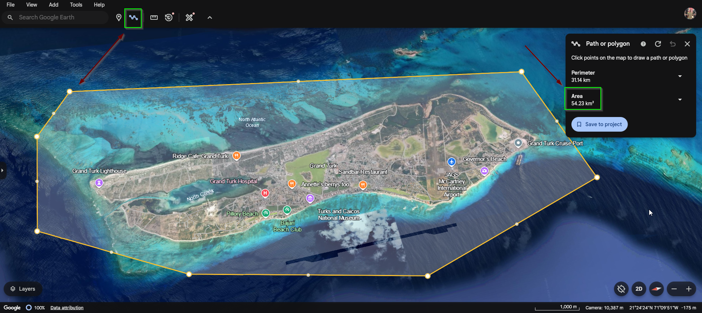

2. **🗺️ Use the Coordinates in Open Topography**:

    - After identifying your target location, Remember the specific area on the map so you can find it in [**OpenTopography**](https://portal.opentopography.org/dataCatalog). This will help in acquiring accurate data for your map creation. 📊
    - Navigate to the `Data Catalog` and search for `**NASA**`. There is various Datasets which provide areas where you can use to grab the Topography from however, for this guide we are going to use `NASA` Dataset under the `Global & Regiobal DEM` tab.

      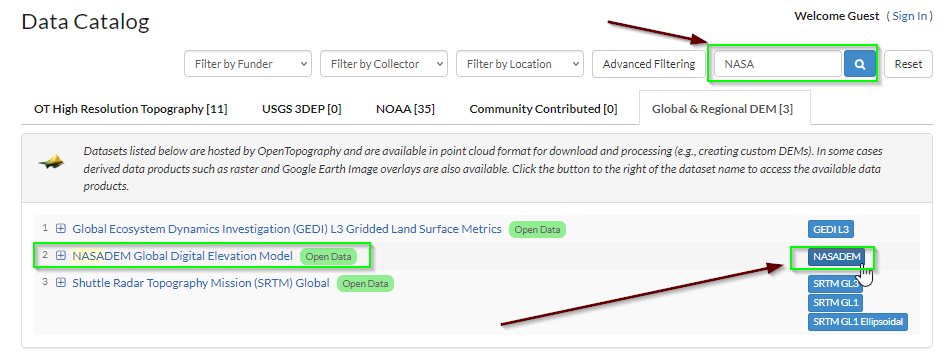

    - Inside the `data to process` which displays the map, change the dropdown settings so that it is selected as `Hybrid`, which will help with selecting your area

      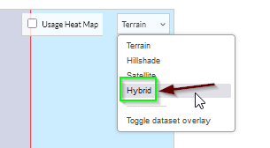

    - Locate the area you found on `Google Maps` in `Open Topography`, then click the button that says **SELECT A REGION** and begin to select the area you want to export.

      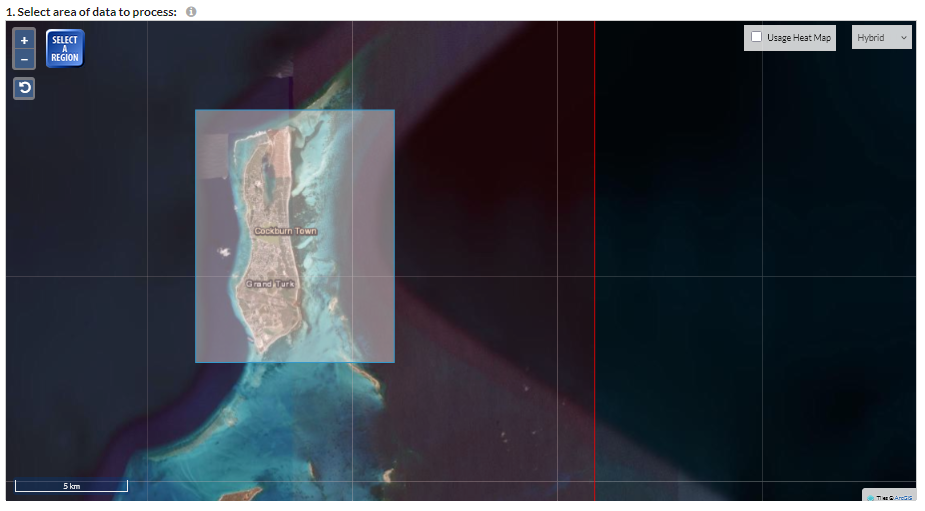

    - **🌐 Coordinates**: Before you can proceed, you need to verify that the area you selected is large enough as well as not to large! At minimum, you will want to have the `Current selection area` at `5 km^2`. Also keep in mind if the selection is to large it will not run within DayZ. We can use `Chernarus` as an example of a good size large map which sits at `225 km^2`. Another example we can use is the Modded Map `Banov` which sits at `256 km^2`. From research done it seems maps larger than this start to see issues.
        - Ensure that your selected area includes sufficient buffer around your intended map to allow for adjustments during editing. 🛠️

      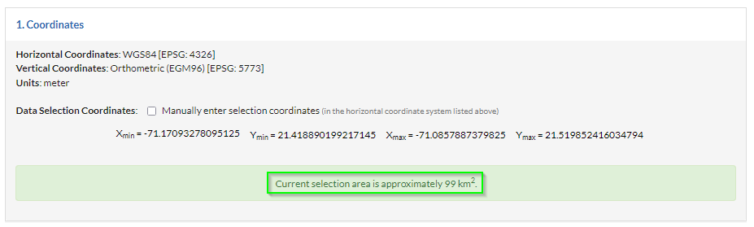

    - **💾 Data Output Formats**
      - Choose **GeoTiff** 📂 for the output format. This ensures compatibility with GIS software like **QGIS** and is essential for creating heightmaps. 📉

      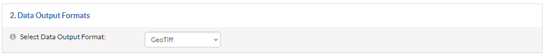

    - **🖼️ Raster Visualization**
      - Under visualization options, you can select features such as **slope**, **aspect**, or **color relief** to see different perspectives of the terrain. 🏞️ These visualizations help determine whether the selected area has the desired topographical features.
      - Ensure that the output format is set to **TIF** 📑 for easy integration with **QGIS**.
      - Consider enabling **hillshade** 🏔️ to get a visual preview of how the terrain will look with lighting effects, which can be helpful for visualizing elevations. 🌞
      - review the image below for how this guide will export the visualization:

        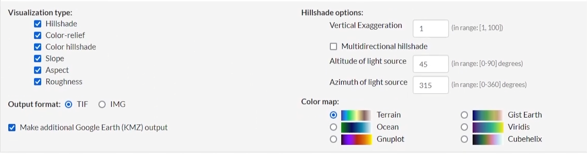

        > ***NOTE***: You may not need all of these settings however, in the event you decide to want one of them it will be available for you to use.

    - **Job Description**
      - This will be the name of your map. It is recommended to provide descriptive data to easily identify it later when importing into ***QGIS***.
      - Ensure you enter you `Email Address` or you will not be able to **Submit** and export your files. (*Image below is blank for privacy*)

        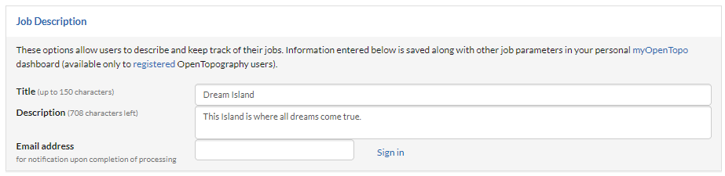

    - **Submit** to begin exporting.
      - While your files are being exported, Open Topography wil lredirect you to a page where it will provide the `Raster job Results` which you can refer to at a later time. The `Email Address` you provide will also include the link to the page.

        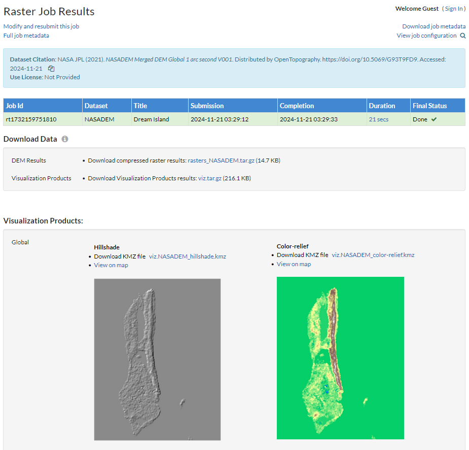

        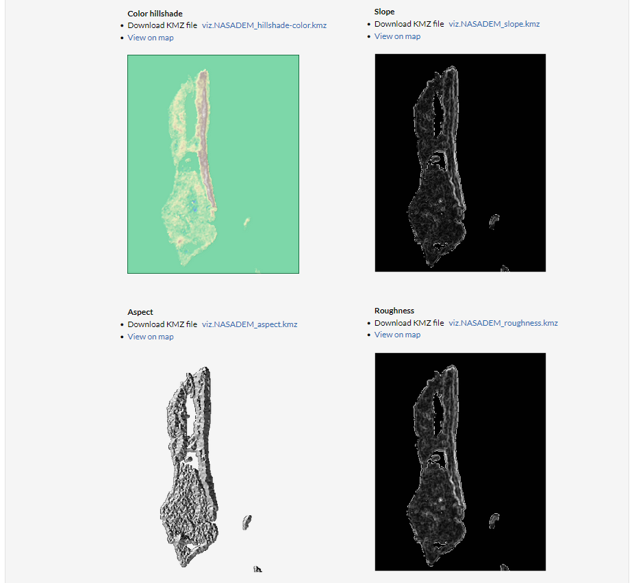

    - **DEM Results**
      - The `DEM Results` is the sipepd fileyou will want to download. You can unzip this with `WinRAR` or `7-Zip` which are both free to use.

        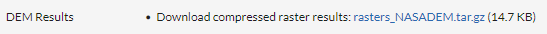

        > ***NOTE***: Once you have downloaded your `DEM Results` you can move back over to [QGIS Overview](./QGIS_Overview.md) guide and continue following the steps provided.
        >
        > Make sure you extract the zipped file you downloaded so that you can properly use it in `QGIS`.
        >
        > Inside your zipped file will contain one file which is a `.tif` file that gets used inside `QGIS`.

## 🚀 Advanced Tips for Open Topography

- **📐 Use Polygons for Precise Area Selection**:
  - By using **Google Earth** to create a **polygon** 🔳 around the region, you can export the polygon and use it in **Open Topography** to make the area selection more precise.
  - Import this polygon into **Open Topography** using supported formats like **KML** or **KMZ**. 🔄

- **🔍 Check Data Resolution**:
  - Depending on your requirements, you may want to choose **higher resolution data** for more detailed maps. Typically, **30m DEM (Digital Elevation Model)** is sufficient for game maps, but **10m DEM** can provide more precision if available. 📏
  - **💡 Tip**: If you are unsure which resolution to use, start with a lower resolution to familiarize yourself with the tools before moving to more complex data. 🚶‍♂️

- **🔧 Process with QGIS**:
  - Once downloaded, load the **GeoTiff** 📂 into **QGIS**.
  - Use **Raster Calculator** in **QGIS** to manipulate the height values for a more suitable heightmap if needed.
  - You can also merge multiple **GeoTiff** files if your desired area covers multiple datasets. This is useful for larger terrains. 🌍
  - Consider using **QGIS Smoothing Filters** 🌀 on the elevation data to reduce jagged terrain and create a more natural look. 🌿

- **🛤️ Overlay with OpenStreetMap (OSM) Data**:
  - To create road networks, consider downloading **OpenStreetMap** (OSM) layers 🌐 and importing them into **QGIS**.
  - Combine this with your **Open Topography** data to ensure roads, rivers, and other features align properly with the terrain. 🌊
  - This combined data can help in identifying key landmarks, water features, and roadways, enhancing the detail and playability of the final terrain. 🗺️✨

## 📖 Additional Resources

- **📜 Open Topography Documentation**: Learn more about how to use advanced features of **Open Topography** effectively [here](https://opentopography.org/learn).
- **🌍 Google Earth**: Use **Google Earth** to explore and identify areas to download topographical data from **Open Topography**. [Google Earth](https://www.google.com/earth/)
- **🎥 YouTube Tutorials**: For a step-by-step walkthrough of using **Open Topography** with **QGIS**, check out:
  - [QGIS Path Getting Started](https://www.youtube.com/watch?v=Y6T-j3CmAGU)
  - [Using Open Topography and QGIS Together](https://www.youtube.com/watch?v=Z3JxqYfp8hg)

By following these steps and tips, you'll be able to effectively use **Open Topography** to acquire the data needed for **DayZ** map creation. Pairing it with **Google Earth** 🌐 and **QGIS** will allow you to create realistic and visually impressive terrains for your game, ultimately enriching the player experience with well-designed, accurate environments. 🎮🌟

