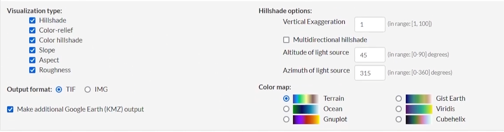

# QGIS Overview

QGIS (Quantum Geographic Information System) is a free and open-source GIS application used for viewing, editing, and analyzing geographic data. It is particularly valuable in mapping and terrain generation, making it ideal for game development projects that require accurate map data.

## Why Use QGIS?

QGIS allows for extensive control over geographic data, enabling users to manipulate data layers, create maps, and process terrain for modding and game design. It is essential for creating realistic and highly detailed maps in game environments.

---

## Installation

### Step 1: Download and Install QGIS

1. Visit the official QGIS download page: [QGIS Download](https://www.qgis.org/download/)
2. Choose the "Long Term Release (LTR)" version for Windows. This version is more stable and suited for long-term projects.
   - Example Download: **Long Term Version for Windows (3.34 LTR)**

---

## Resources Needed with QGIS

1. **OpenTopography**  
   - Provides access to high-resolution topographic data.
   - Visit the following URL for data: [OpenTopography Link](https://portal.opentopography.org/raster?opentopoID=OTSRM.082015.4326.1)

2. **Game Terrain Tools**  
   - A plugin used to work with game-specific terrain needs in QGIS.
   - Visit the GitLab repository: [Game Terrain Tools Wiki](https://gitlab.com/Adanteh/qgis-game-terrains/-/wikis/home)
   - Navigate to the "Download" section and download the latest `gtt.zip` file.

3. **Mikeros Tools**
   - You want to ensure that you have all the required tools install and setup properly. You can find more details in the [Mikero Tools Overview](../mikero_tools/Mikero_Tools_Overview.md) guide.

4. **DayZ Tools**
   - A suite providing various utilities to help you build, modify, and publish custom content for the game, such as maps.
   - Visit our [DayZ Tools Overview](../dayz_tools/DayZ_Tools_Overview.md) guide for additional details.
   - Youtube Tutorials Installing DayZ Tools
      - Grampa's - DayZ Channel: [Getting Started - DayZ Tools](https://youtu.be/r4bTNuRQWDU?si=gXjhRZTxRz66ixe6&t=45)

---

## Installing Game Terrain Tools (GTT) Plugin in QGIS

1. **Start QGIS**  
2. Go to `Plugins` > `Manage and Install Plugins...`
3. Click on the sidebar option `Install from ZIP`
4. Locate and select the `GTT.zip` file you downloaded earlier.

---

## Verifying GTT Installation

1. In QGIS, go to `Plugins` > `Game Terrain Tools` to confirm installation.
2. You should see options for "Game Terrains" and "Objects" under the Game Terrain Tools menu.

---

## Activating GTT Panel in QGIS

1. To access the GTT panel, go to `Plugins` > `Game Terrain Tools` > `Game Terrains`.
2. In the panel, ensure the **Engine** is set to **Arma**.
3. Configure additional settings such as:
   - **Mark Area**: Set to `4096 meters`
   - **Scaling**: Set to `4096 meters`
   - **Zoom Level**: Set to `17`
   - **Resolution**: Set to `-1 px`
   - **Export Satmap**: Box checked

---

## Open Topography Settings

1. **Coordinates**: Minimum area selection should be 5 km².
2. **Data Output Formats**: Choose **GeoTiff** for output format.
3. **Raster Visualization**:
   - Select visualization type and other options like slope, aspect, or color relief.
   - Output format should be **TIF**.

---

## Useful Layers for Road Creation

To create roads, make sure the following layers are included:

- `osm_multipolygons`
- `osm_lines`

---

## YouTube Tutorials

For additional guidance, check out this video tutorial:

- [QGIS Path Getting Started](https://www.youtube.com/watch?v=Y6T-j3CmAGU)
