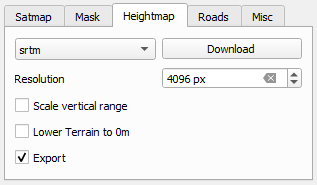

# QGIS Overview

QGIS (Quantum Geographic Information System) is a free and open-source GIS application used for viewing, editing, and analyzing geographic data. It is particularly valuable in mapping and terrain generation, making it ideal for game development projects that require accurate map data.

## Why Use QGIS?

QGIS allows for extensive control over geographic data, enabling users to manipulate data layers, create maps, and process terrain for modding and game design. It is essential for creating realistic and highly detailed maps in game environments.

## Installation

### Step 1: Download and Install QGIS

1. Visit the official QGIS download page: [QGIS Download](https://www.qgis.org/download/)
2. Choose the "Long Term Release (LTR)" version for Windows. This version is more stable and suited for long-term projects.
   - Example Download: **Long Term Version for Windows (3.34 LTR)**

## Resources Needed with QGIS

1. **OpenTopography**  
   - Provides access to high-resolution topographic data.
   - Check out the [Open Topography Overview](./OpenTopography_Overview.md) guide for additional details

2. **Game Terrain Tools**  
   - A plugin used to work with game-specific terrain needs in QGIS.]
   - Visit the GitLab repository: [Game Terrain Tools Wiki](https://gitlab.com/Adanteh/qgis-game-terrains/-/wikis/home)
   - Navigate to the "Download" section and download the latest `gtt.zip` file.

3. **Mikeros Tools** (*Install/Setup After DayZ Tools Before Using QGIS*)
   - You want to ensure that you have all the required tools install and setup properly. You can find more details in the [Mikero Tools Overview](../mikero_tools/Mikero_Tools_Overview.md) guide.

4. **DayZ Tools** (*Install/Setup Before Using QGIS*)
   - A suite providing various utilities to help you build, modify, and publish custom content for the game, such as maps.
   - Visit our [DayZ Tools Overview](../dayz_tools/DayZ_Tools_Overview.md) guide for additional details.
   - Youtube Tutorials Installing DayZ Tools
      - Grampa's - DayZ Channel: [Getting Started - DayZ Tools](https://youtu.be/r4bTNuRQWDU?si=gXjhRZTxRz66ixe6&t=45)

## Installing Game Terrain Tools (GTT) Plugin in QGIS

1. **Start QGIS**

   

2. Go to `Plugins` > `Manage and Install Plugins...`

   

3. Click on the sidebar option `Install from ZIP`

   

4. Locate and select the `GTT.zip` file you downloaded earlier.
   > ***NOTE***: You will need to download this from [Game Terrain Tools Wiki](https://gitlab.com/Adanteh/qgis-game-terrains/-/wikis/home)

   

   

## Verifying GTT Installation

1. In QGIS, go to `Plugins` > `Game Terrain Tools` to confirm installation.
2. You should see options for "Game Terrains" and "Objects" under the Game Terrain Tools menu.

   

## Activating GTT Panel in QGIS

1. To access the GTT panel, go to `Plugins` > `Game Terrain Tools` > `Game Terrains`.

   

2. In the panel, ensure the **Engine** is set to **Arma**.

   

   

   > NOTE: Using Engine `Arma` is not something that is definitive. You can also use `Enfusion` however sometimes due to the size of your map it may throw errors. The example is this guide is only showing steps for a `Height Map` and a `SAT Map` which could be used for either Engine types in multiple applications.

3. Configure additional settings such as:
   - **General Settings**
      - **Mark Area**: Set to `4096 meters`
      - **Scaling**: Set to `4096 meters` (*Unchecked*)
      - **Engine**: Set to `Arma`

         

   - **Satmap Settings**
      - **Zoom Level**: Set to `17`
      - **Resolution**: Set to `-1 px`
      - **Tiling**: Set to `4096 px` (*Unchecked*)
      - **Export Satmap**: Box checked

         

   - **Mask Settings**
      - **Export Mask**: Unchecked
      - **Regions of Interest**: Do not select
      - **OSM Based**: Select this radio button

         

   - **Heightmap Settings**
      - **DropDown**: srtm
      - **Resolution**: Set to `4096 px`
      - **Scale verticle range**: Unchecked
      - **Lower Terrain to 0m**: Unchecked
      - **Export**: Box Checked

         

   - **Roads Settings** (*Specific Defined Layer Required from Open TopoGraphy*)
      - **Raw export**: Unchecked
      - **Export Roads**: Checked
      - **Export Shapes**: Checked

      > ***NOTE***: You will need two layers created for you you export both the `Roads` and `Shapes`. Please refer to our [Useful Layers For Road Creation](#useful-layers-for-road-creation) section for additional details.

## Import Open Topography TIF File

- Locate the `DEM Results` you received from your exported Open Topography selection and `drag & drop` it into the middle of your `QGIS` window like shown below.

   

   > ***NOTE***: After you draged and dropped the TIF file you will need to save this project or you will run into errors for future steps.

### Save QGIS Project

   1. Save your `QGIS` project on your **P Drive**. You can name the folder anything you would like however for this guide we are going to keep it simple and name it ***`QGIS`***
      - Navigate to `Project > Save As` and save your project under yor **P Drive** in a new fodler called `QGIS`.

## Resolve Pixelized TIF File

- Select the `Satmap` tab in your GTT (Game Terrain Tools) Panel and select the button `Add satmap`.

   

- By applying this, it will generate a new layer called `gtt_satmap`. This layer should be at the top in this point of a step.

   

   > ***Tip***: If you do not see a layers panel you can enable it by navigating to `View > Panels Layers`. Ensure that the **Layers** option is checked.

## Heightmap and Size Overview

- Inside the GTT, you see the first two (top) fields that display a size in meters will determine the size of your map whichyou will be selecting. If you are needing a size large than the default, `2048`, you can increase this. However, you should not increase this number larger than `20480`, otherwise it could cause performance issues and other unknown problems with your map. (*This is equivalent to say having 4 chernarus maps combined*) Once you have your desired size inputted, select the `Mark Area` button to ensure it covers the area you are wanting to make a map out of. This will generate a new layer which saves your selected area:

   

- Next we are going to change the name of the TIF file we imported, which is already a layer and change its name to `gtt_heightmap`

   **`OLD Layer Name`** (*This may vary depending on the Dataset you used in Open Topograpgy*)

   

   **`New Layer Name`**

   

- After we have done this we will need to `Export` both the **`Satmap`** and **`Heightmap`** but ensure both the GTT opions are checked for `Export`. Review the images below and ensure that you have identical options **checked* and **unchecked**.

   
   
   
   

   > ***NOTE***: If you have not `Drag & Dropped` a TIF file that you obtained from **Open Topography** you can instead generated a `gtt_heightmap` by clicking on download inside the `GTT Heightmap` tab.
   >
   > ***Tip**: If you get a `Login` Popup Window, go ahead and create a free account on their website and login to continue.
   >
   > Once you see that the data has finished downloaded and reached 100% you can proceed with exporting for `Satmap`, `Mask` and `Heightmap`.

- Let's first proceed with exporting only your `Mask`. Navigate to the `Mask` tab and ensure only this `Export` is checked, then hit ***Export***. Once completed you will see a message that says **Export done!**. Once done uncheck the `Export Mask` box.

   

- Next we want to export the `Heightmap`. Lets makesure nothing else is checked to be exported except for the Heightmap check box. Also we want to make sure that both in `Satmap` and `heightmap` the resolutions are identical. Ifyou left the default values `4096 px` this is fine, just know that this is a detailed version to the map you are exporting. Low amounts will provide a lower resolution and require less detailed work. Once you have the `Export` box check, let's proceed with exporting the `Heightmap` data. Once you have completed the data export you will receive a message stating **Export done!**.

   

- We want to follow the same steps as above except now we are going to do this for `Satmap`. Ensure nothing else is checked to be exported except only the `Satmap` export check box. Then proceed with clicking on the `Export` button. Once the process is completed you will receive a message stating **Export done!**.

   > ***NOTE***: This process may take some time to complete depending on the size of your map. Be patient and allow the program to export the data.

   

## Useful Layers for Road Creation

To create roads, make sure nothing else is checked to be exported insidethe GTT. Once you select the `Download` button under the **Roads** tab, two additional layers will be created:

- `osm_multipolygons`
- `osm_lines`

  - These layers are created when you click the `Download` button under the **GTT Roads** tab. However, before clicking the download button, make sure in the other tabs you do not have anything checked to be exported.
  - Not only will it obtain roads, it will also collect data such as trees, rivers, paths, grass, etc..

  

  - Now that we have a list of items inside our layers, go through the list and check the ones you actually want to export. For this example I am going to check almost every item in the list as shown below. Then ensure that both `Roads` and `Shapes` and checked and select the **Export** button. Once the process is completedyou will receive a message stating **Export done!**.

   

   

  > ***NOTE***: Uncheck `Roads` and `Shapes` onces both layers have been created and you have exported the options you want.

## Conculsion

- Once you have followed all the stepsabove you are ready to move onto [Terrain Builder Overview](../dayz_tools/terrain_builder/Terrain_Builder_Overview.md) guide and proceed with your map creation.
- Inside the Folder you created called `QGIS` will have **QGIS** related files as shown below:

   

- Inside the `QGIS > gtt_export` folder are files you can use inside `Terrain Builder`.

   

## YouTube Tutorials

For additional guidance, check out this video tutorial:

- [QGIS Path Getting Started ***BY: Ikeozzy***](https://www.youtube.com/watch?v=Y6T-j3CmAGU)
- [Demo - Create a DayZ map in less than 2 hours. ***BY: Grampa***](https://youtu.be/9KgE25NZ0lc?si=uqbOOqBHwQW9GZeo)
